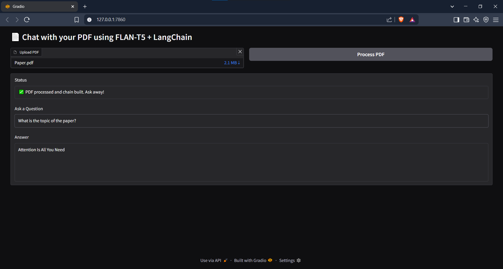

# 📄 Chat with Your PDF using FLAN-T5 + LangChain + Gradio

This project allows you to **chat with the contents of any PDF** using a powerful combination of:

- 🔍 **LangChain** for document loading, chunking, retrieval
- 🤖 **FLAN-T5** (via Hugging Face) for natural language question answering
- 📁 **FAISS** for efficient vector search
- 🧠 **Sentence Transformers** for embedding chunks
- 🎨 **Gradio** for a sleek and simple interactive UI

---

## ✨ Features

- Upload any PDF and convert it to smart searchable chunks
- Ask natural questions about the PDF
- Uses generative QA (`google/flan-t5-large`)
- Works on CPU (no GPU required)
- Fully interactive web interface with Gradio

---

## 🚀 Demo



---

## 🛠️ Installation

You can run this on your **local machine** or **Google Colab**.

### 🖥️ Local Setup

```bash
git clone https://github.com/jaysheeldodia/pdf-chat-flan-t5.git
cd pdf-chat-flan-t5

# Create and activate a virtual environment (optional)
python -m venv venv
source venv/bin/activate  # or venv\Scripts\activate on Windows

# Install dependencies
pip install -r requirements.txt

# Run the app
python app.py
